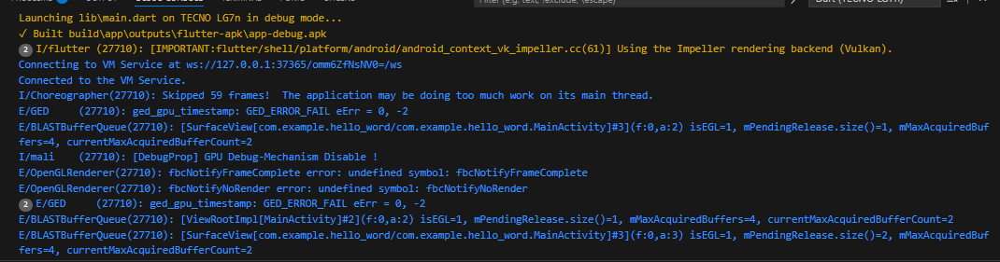
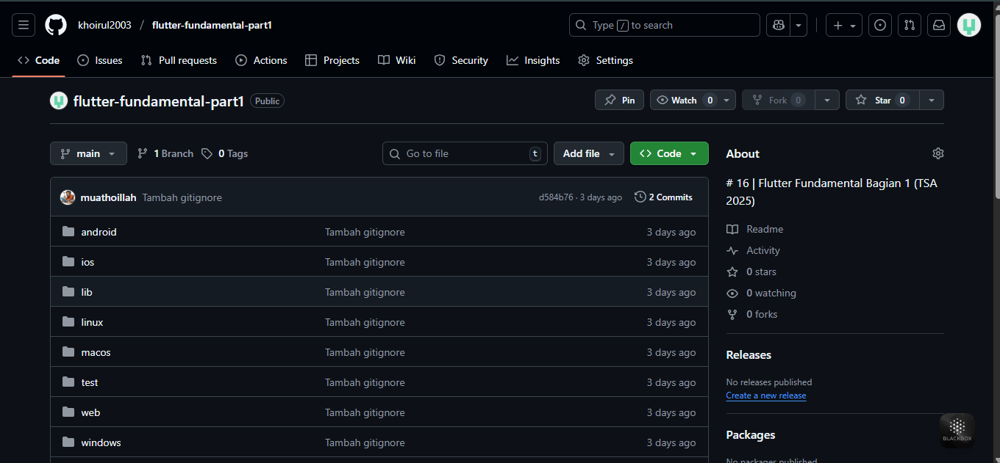

# hello_word

A new Flutter project.

## Getting Started

This project is a starting point for a Flutter application.

A few resources to get you started if this is your first Flutter project:

- [Lab: Write your first Flutter app](https://docs.flutter.dev/get-started/codelab)
- [Cookbook: Useful Flutter samples](https://docs.flutter.dev/cookbook)

For help getting started with Flutter development, view the
[online documentation](https://docs.flutter.dev/), which offers tutorials,
samples, guidance on mobile development, and a full API reference.

1. Practicum 1: Creating a New Flutter Project

  Step 1: 
  Open VS Code, then press Ctrl + Shift + P to bring up the Command Palette, then type Flutter. Select New Application Project.

  

  Step 2:
  Create a Flutter project named hello_world as shown below, then press Enter. Wait until the new project creation process is complete.

  

  Step 3:
  Once you have finished creating a new project, make sure it looks like this. A message will appear saying “Your Flutter Project is ready!”, meaning you have successfully created a new Flutter project.

  

2. Practicum 2: Connecting an Android Device or Emulator

  

  

3. Praktikum 3: Membuat Repository GitHub dan Laporan Praktikum

  

4. Practicum 4: Applying Basic Widgets

  Step 1: Text Widget
  

  Step 2: Image Widget
  

5. Practicum 5: Applying Material Design and iOS Cupertino Widgets

  Step 1: Cupertino Button and Loading Bar
  

  Step 2: Floating Action Button (FAB)
  

  Step 3: Scaffold Widget
  

  Step 4: Widget Dialog
  

  Step 5: Input and Selection Widget
  

  Step 6: Date and Time Pickers
  

  